**Конфигурация:** Stellafane + Leavitt гибрид

| Параметр | Значение |
|---|---|
| Главное зеркало | 203мм, f=1200мм, f/5.9 |
| Вторичное зеркало | 50мм эллиптическое (малая ось) |
| Труба | Сонотуб Golmat ST410250, ID 250мм, длина 1250мм |
| Монтировка | Добсон |
| Фокусёр | Leavitt collet-squeeze (печатный, 1.25") |
| Искатель | SVBONY SV182 6×30 |
| Окуляры | Plossl 25мм + 10мм |

**Принцип:** оптика и фокусёр — фабричные/печатные, оправа главного и монтировка — деревянные (Stellafane-классика). Это решает проблему «Leavitt спроектирован под трубу 210мм, а сонотуб у нас 250мм».

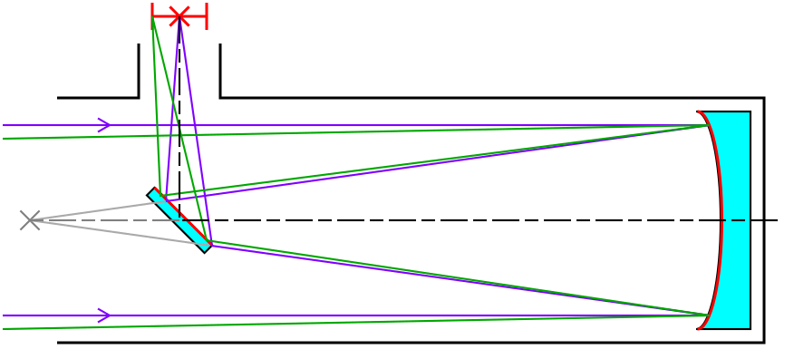{width=85%}

### Анатомия телескопа

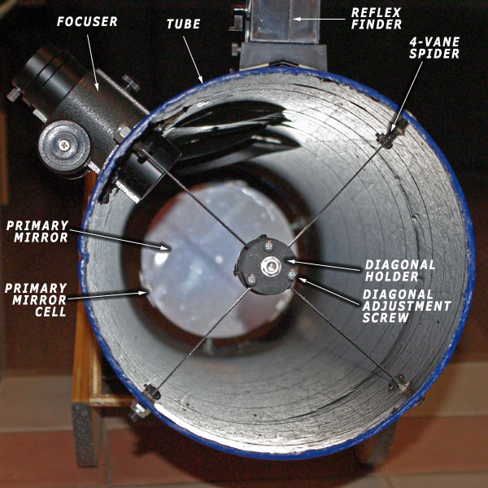{width=75%}

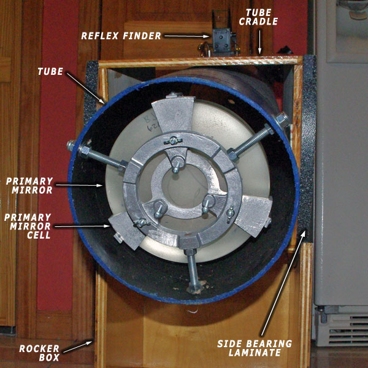{width=75%}

---

## Фаза 0 — инвентаризация и инструмент

### Проверить наличие

**Оптика и аксессуары:**

| □ Главное зеркало 203мм f/1200мм
| □ Вторичное 50мм
| □ Окуляры 25мм и 10мм
| □ Лазерный коллиматор
| □ Калибровочный окуляр (cheshire)
| □ Искатель SVBONY SV182

**Труба:**

| □ Сонотуб Ø250мм длиной ≥1250мм

**Крепёж (Galboreg):**

| □ M5×12 болт × 20
| □ M5×20 болт × 5 (pull-болты оправы)
| □ M5×50 болт × 5 (push-болты оправы)
| □ M5 гайка × 20
| □ M5 nylock × 5
| □ M5 барашковая гайка × 5 (ручки коллимации — заменяют печатные Knob)
| □ M10×60 болт × 1 (азимутальная ось рокера)
| □ M10 гайка × 2, M10 fender washer × 2
| □ Шурупы по дереву 4×40 × 30

**Расходники (Home Center):**

| □ Матовая чёрная краска Maxol 400 мл
| □ Силикон Super 7 нейтральный 290 мл
| □ Войлочные прокладки 26мм × 12

**Дерево (ДОКУПИТЬ):**

| □ Фанера 18мм берёзовая — 1 лист 60×120 см (на оправу + люльку)
| □ Фанера 18мм — 1 лист 80×120 см (на рокер-бокс)
| □ Брусок 30×30мм длиной 1м (рёбра жёсткости)

**Металл (ДОКУПИТЬ):**

| □ Уголки металлические 30×30мм × 4-6 (крепление оправы к трубе)
| □ Шайбы плоские M5 × 12

**Прочее:**

| □ PTFE прокладки 3мм × 6 ✅ (есть)
| □ Резиновые ножки Ø30-40мм × 3 (на ground board)
| □ Изопропил для обезжиривания зеркал

### Инструмент

Дрель/шуруповёрт, лобзик (или ножовка по дереву), сверла 5/8/10мм, наждачка P120 и P400, измерительный угольник, рулетка, маркер, ножовка по картону (для сонотуба).

---

## Фаза 1 — Печать (запустить ПЕРВЫМ, фоном 2-3 дня)

11 деталей в `stl/`, разбиты по трём группам настроек печати (резьба / стандарт / крупное) — детали и параметры см. `stl/README.md`. Суммарно ~35 ч печати.

**Порядок печати (от мелкого к крупному, чтобы быстро проверить настройки):**

1. Focuser grub + Focuser grub screw panel (мелочь для проверки экструдера)
2. Collet + Collet nut + 1.25" eyepiece adapter
3. Focuser ring
4. Focuser inner (резьба — слой 0.2мм или 0.1мм!)
5. Focuser outer bottom + Focuser outer top
6. Secondary holder
7. **Spider.stl** — самая большая, плашмя, с brim

Все детали можно печатать **любым** цветом — внутренние поверхности (которые видят свет) красим чёрной аэрозолью после печати.

⚠️ **Резьбовая группа** (Focuser inner, Focuser outer top/bottom, Focuser ring, Collet, Collet nut) — печатать одной катушкой подряд, без замены пластика. Разная усадка партий филамента может привести к закусыванию резьбы.

---

## Фаза 2 — Подготовка трубы

### Размеры

```
Минимальная длина трубы — 1250мм. Допустимо до 1500мм (лишнее = более длинный
козырёк над вторичкой, оптически только в плюс).

Расчёт минимума для f=1200мм:
  Главное → вторичное (оптический путь):            1050мм
  Запас за зеркалом (высота оправы):                 +50мм
  Козырёк над вторичным (защита от засветки):       +150мм
  ────────────────────────────────────────────
  ИТОГО минимум:                                    ~1250мм
```

**Если сонотуб длиннее (1300-1400мм)** — не отрезай. Лишние сантиметры становятся более длинным «козырьком» над вторичкой, защищая от боковой засветки. Минус только в чуть большем весе (~200г на 150мм).

### Шаги

1. **Отпилить сонотуб** до нужной длины (минимум 1250мм, допустимо до 1500мм). Размечай маркером по кругу, ножовкой по картону. Кривой срез видно при наблюдении.

2. **Покрасить изнутри** матовой чёрной краской в 2-3 слоя. Сушить 24 часа. Это критично для контраста.

3. **Разметить отверстия под фокусёр и паука:**

   ```
   позиция_от_низа = высота_оправы + 1050мм оптики
                   ≈ 50мм + 1050мм
                   = ~1100мм от низа трубы
   ```

   - **Отверстие под фокусёр** Ø45-50мм: на ~**1100мм** от нижнего края, строго сбоку (на 90° от любого продольного шва картона)
   - **4 отверстия под лапки паука** под M5 болт: на той же высоте, крест-накрест (через 90°). Одна пара — на одной горизонтали с фокусёром, вторая — перпендикулярно
   - **Отверстия под оправу** — позже, по месту после сборки оправы

   💡 **Точнее:** сначала собери оправу (Фаза 3), замерь её реальную высоту от низа до поверхности зеркала, добавь 1050мм — это и есть точная позиция паука. Разница ±10-20мм допустима, фокусёр компенсирует.

4. **Сверлить.** Сначала тонким сверлом (3мм), потом расширять. Под фокусёр — коронкой по дереву или круглым напильником.

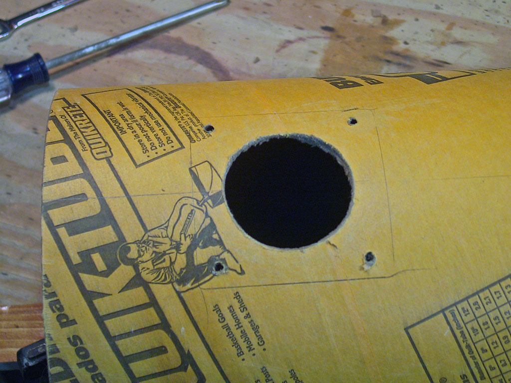{width=60%}

---

## Фаза 3 — Оправа главного (Stellafane-стиль)

### Принцип

Две пластины (передняя круглая, задняя — треугольная Y-форма с 3 ушами до стенки трубы), скреплённые 3 группами push-pull болтов. Зеркало лежит на передней пластине на войлоке, фиксируется силиконом. Push-болты при вращении наклоняют переднюю пластину вместе с зеркалом — это коллимация.

> 💡 **Два варианта:** либо вырезать обе пластины из фанеры 18мм по размерам ниже, либо напечатать `Mirror_cell_front.stl` + `Mirror_cell_back.stl` (см. `stl/mirror_cell/`, группа D). Печатный вариант: PETG/ASA, 8+ стенок, 30-40% gyroid, ~20ч печати на пару. У печатной задней пластины 3 встроенных вертикальных таба на ушах — заменяют металлические уголки 30×30мм. Геометрия (отверстия, диаметры) одинаковая, ниже описано как для фанерного варианта; для печатного — пропустить раскрой/шлифовку/покраску, всё остальное идентично.

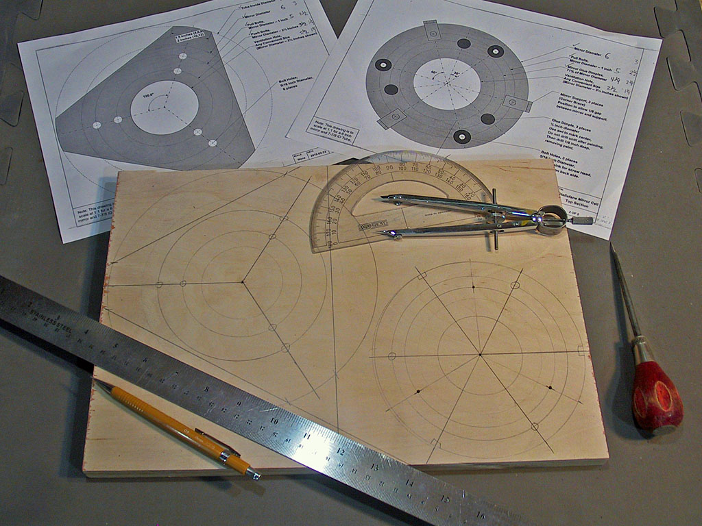{width=75%}

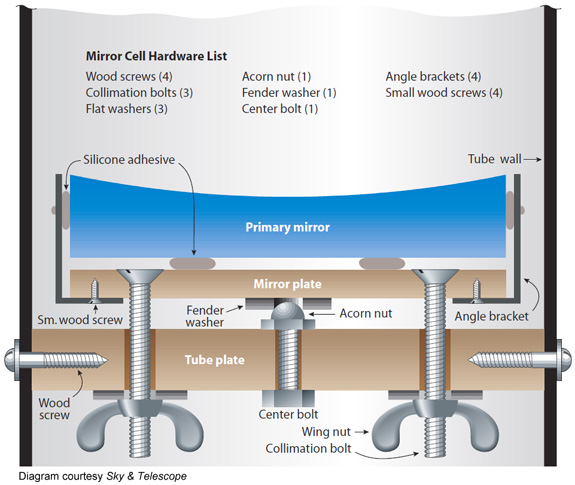{width=75%}

### Размеры

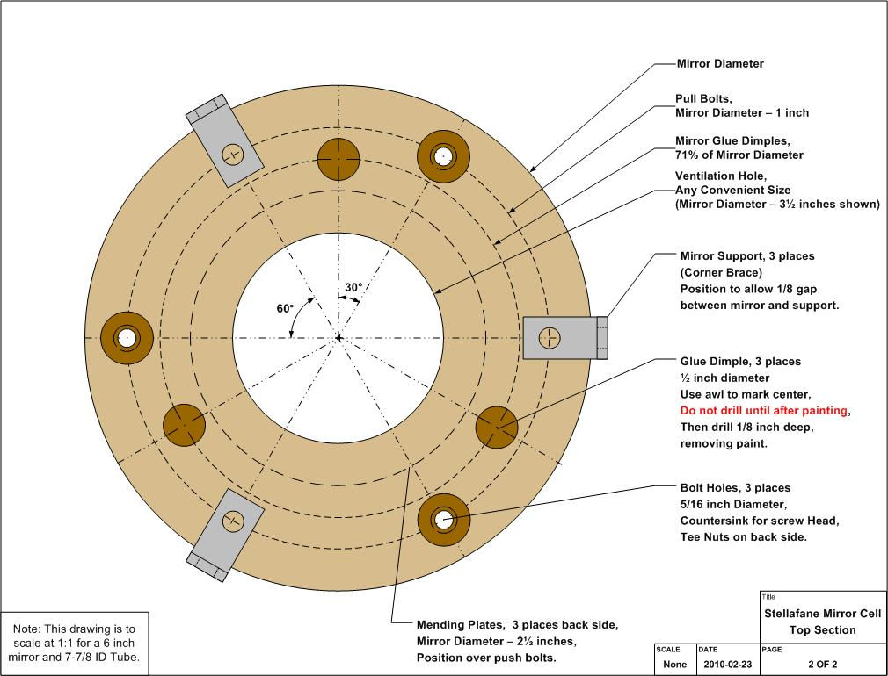{width=70%}

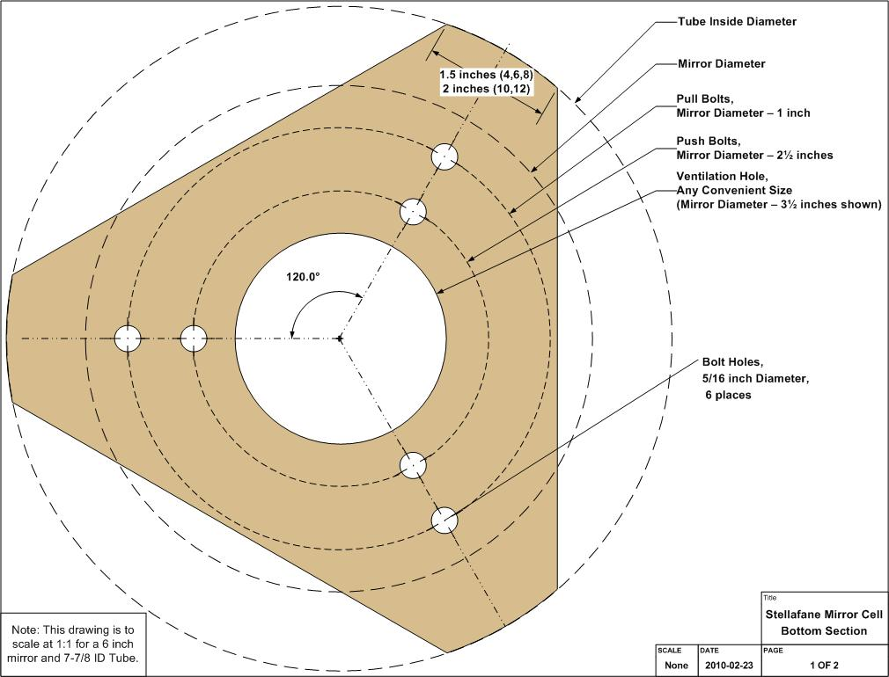{width=70%}

> ⚠️ Оригинальные чертежи Stellafane выполнены в масштабе 1:1 под зеркало 6" и трубу ID 7-7/8" (≈200мм). Концепция и расположение отверстий — наши, но **абсолютные размеры пересчитаны** под наше зеркало 203мм и трубу ID 250мм (см. ниже).

**Передняя пластина (mirror plate):**

- Круг Ø215мм из фанеры 18мм (на 12мм больше зеркала 203мм — выступ 6мм по радиусу для опоры)
- 6 отверстий Ø6мм под коллимационные болты, в виде **3 push-pull пар** на углах 0°/120°/240° (= центры ушей задней пластины). В каждой паре: push на радиусе 95мм + pull на радиусе 80мм, оба на одной радиальной линии. Push и pull одной пары работают вместе — pull притягивает пластины, push отталкивает.
- Центральное отверстие Ø30мм — вентиляция (опционально)

**Задняя пластина (tube plate):**

- Треугольная Y-форма из фанеры 18мм, по чертежу Stellafane Bottom Section
- 3 «уха» вытянуты до Ø250мм (= внутренний диаметр трубы, упираются в стенку)
- Между ушами — вогнутые вырезы радиусом ~110мм (экономия веса, вентиляция)
- 6 отверстий Ø6мм в ушах (по 2 на каждое ухо): push на радиусе 95мм + pull на радиусе 80мм — точно напротив отверстий передней пластины (push-pull пары на одной радиальной линии, болты идут насквозь через обе пластины)
- Центральное отверстие Ø30мм — вентиляция (опционально)
- Крепление к трубе: по одному шурупу/болту M5×12 через каждое ухо в стенку трубы (3 точки через 120°)

### Hardware

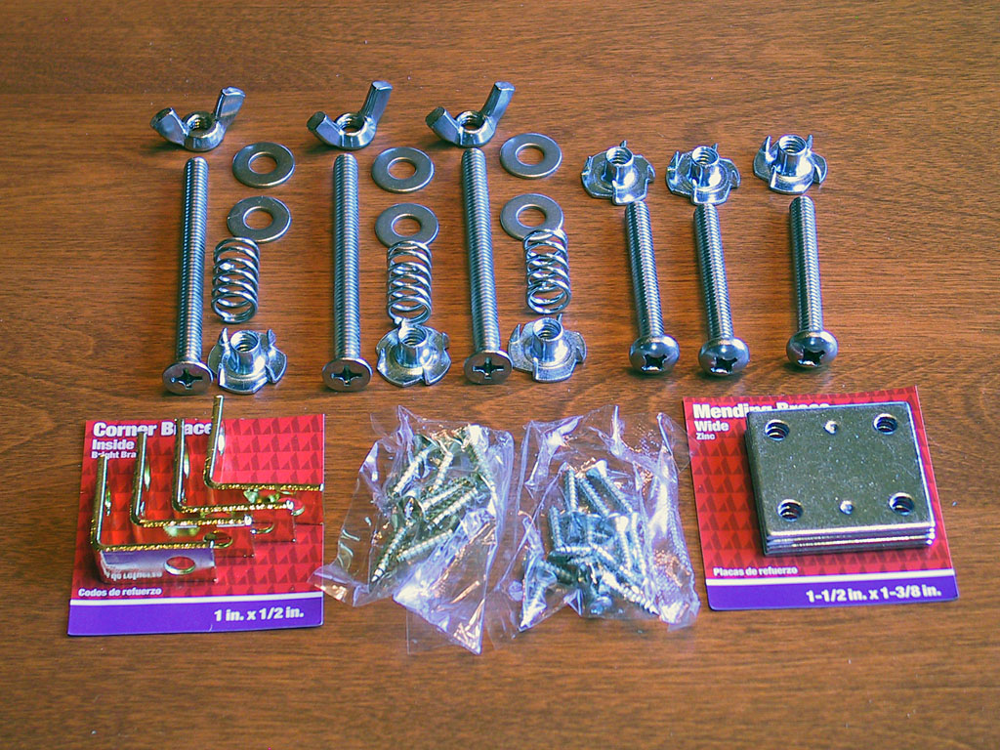{width=75%}

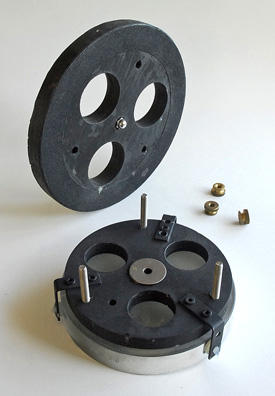{width=70%}

### Сборка оправы

1. **Раскрой:**
   - Передняя: круг Ø215мм — коронкой или лобзиком.
   - Задняя: разметить Y-форму на фанере 18мм. Сначала нарисовать окружность Ø250мм (= внешний контур ушей). Затем из центра разметить 3 направления через 120° — это центры ушей. Между ушами — вогнутые дуги радиусом ~110мм (касаются окружности Ø250мм между ушами, образуя «талию» Y-формы). Выпиливать лобзиком, шлифовать кромки.

2. **Шлифовка:** P120, потом P400. Грани слегка скруглить.

3. **Покраска:** обе пластины красишь матовой чёрной (внутри и снаружи — чтобы не отражали). Сушка сутки.

4. **Войлок:** наклей **3 войлочные прокладки** 2-3мм на переднюю пластину в местах, где будет лежать зеркало (по 120°, на радиусе 90мм). Зеркало НЕ должно касаться дерева напрямую.

5. **Push-pull механика:**
   - Вкрути 3 болта **M5×50** в задней пластине снизу вверх, через отверстия. На каждый болт сверху — пружина сжатия + шайба.
   - Передняя пластина ложится сверху на пружины, болты проходят через её отверстия.
   - Сверху барашковые гайки M5 (доступны снаружи трубы для коллимации).
   - 3 коротких болта **M5×20** проходят сквозь обе пластины — это pull (ограничитель).

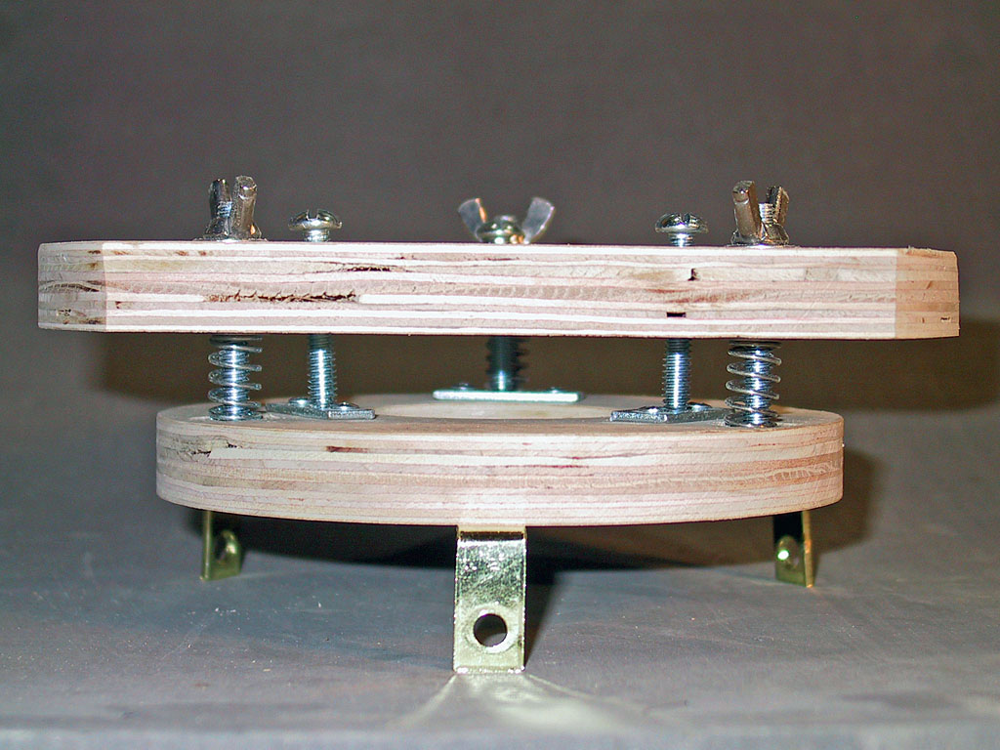{width=65%}

6. **Крепление к трубе:** через каждое из 3 ушей задней пластины — шуруп по дереву или болт M5×12 насквозь через стенку трубы. 3 точки через 120°. Перед сверлением совместить пластину с трубой, разметить отверстия в картоне через уши, просверлить отверстия Ø5мм в стенке трубы, прикрутить. При желании можно дополнительно усилить металлическим уголком 30×30мм на каждом ухе — но при правильной посадке Y-плиты в трубу 3 шурупов достаточно.

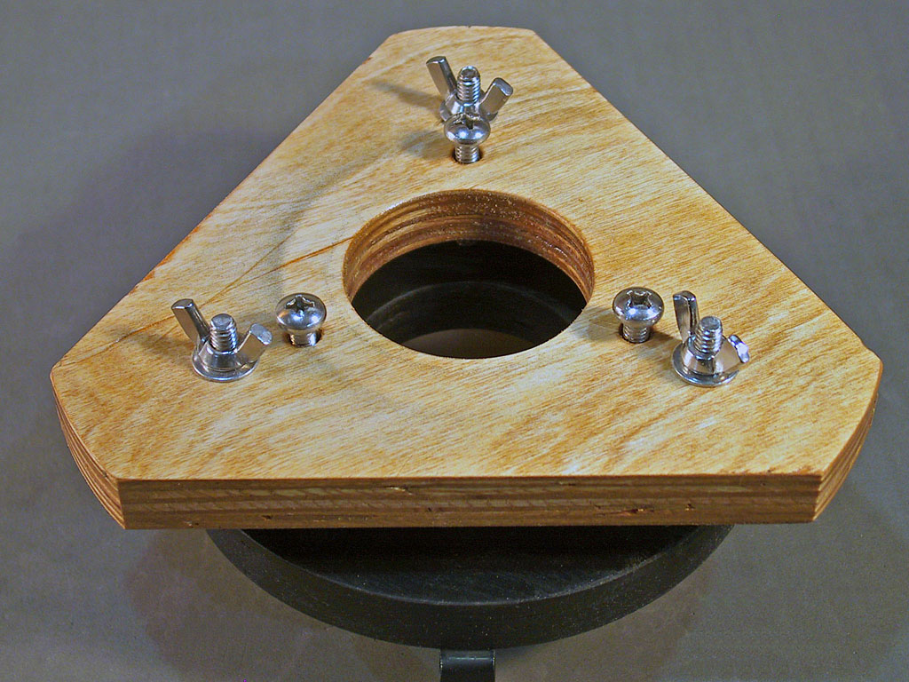{width=65%}

7. **Установка зеркала** — **последним шагом**, перед финальной сборкой:
   - Зеркало вогнутой стороной вверх, ложится на 3 войлочные прокладки
   - **3 капли нейтрального силикона** (размером с горошину) на края зеркала между прокладками — фиксация от смещения
   - 24 часа сушки
   - Зеркало **НЕ** должно быть зажато — оно лежит свободно

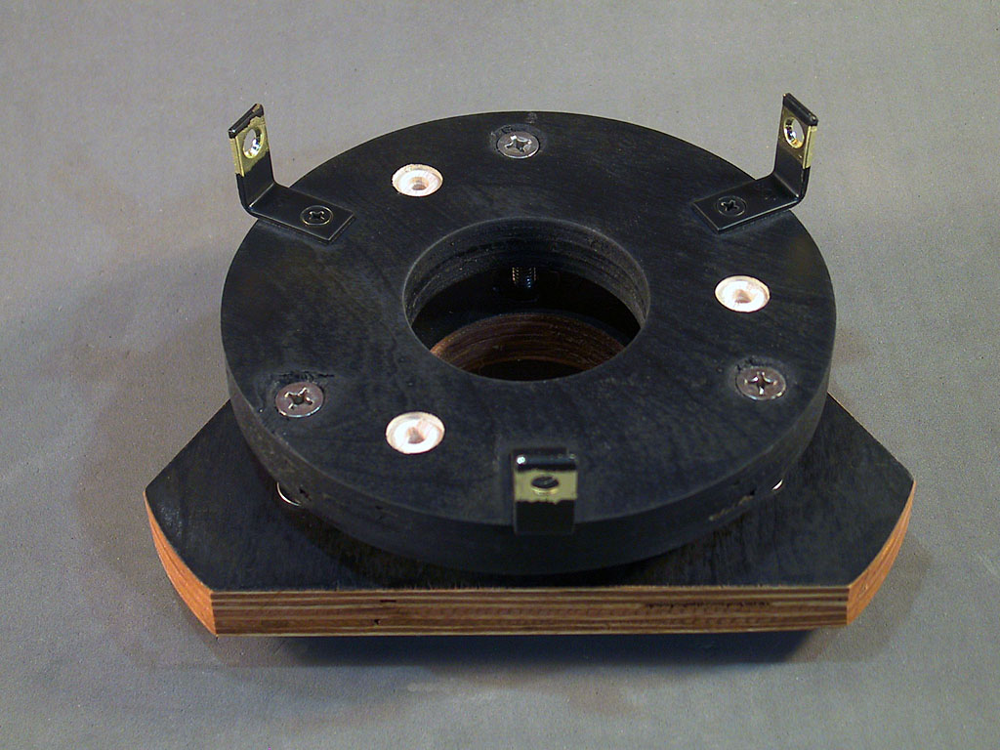{width=70%}

---

## Фаза 4 — Паук и держатель вторичного

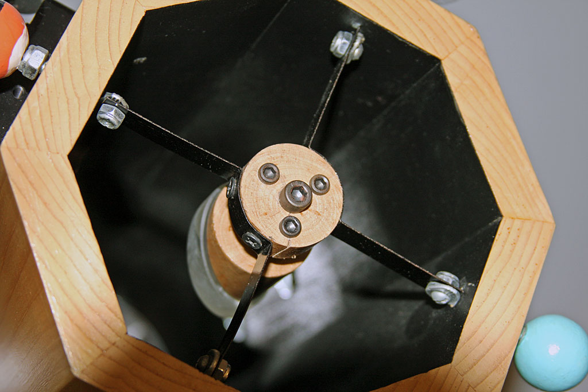{width=70%}

### Паук (`Spider.stl`)

Печатается плашмя, span ровно 250мм — точно в трубу.

После печати:

1. Просверли **центральное отверстие** Ø5мм во втулке (под крепление держателя вторички)
2. Просверли **4 отверстия Ø5мм** в монтажных пятаках (по центру каждого пятака)

### Держатель вторичного

`Secondary holder.stl` — печатный, 57×57×69мм. Болтится к центру паука одним центральным болтом (M5×20 с nylock-гайкой — позволяет поворачивать держатель для коллимации).

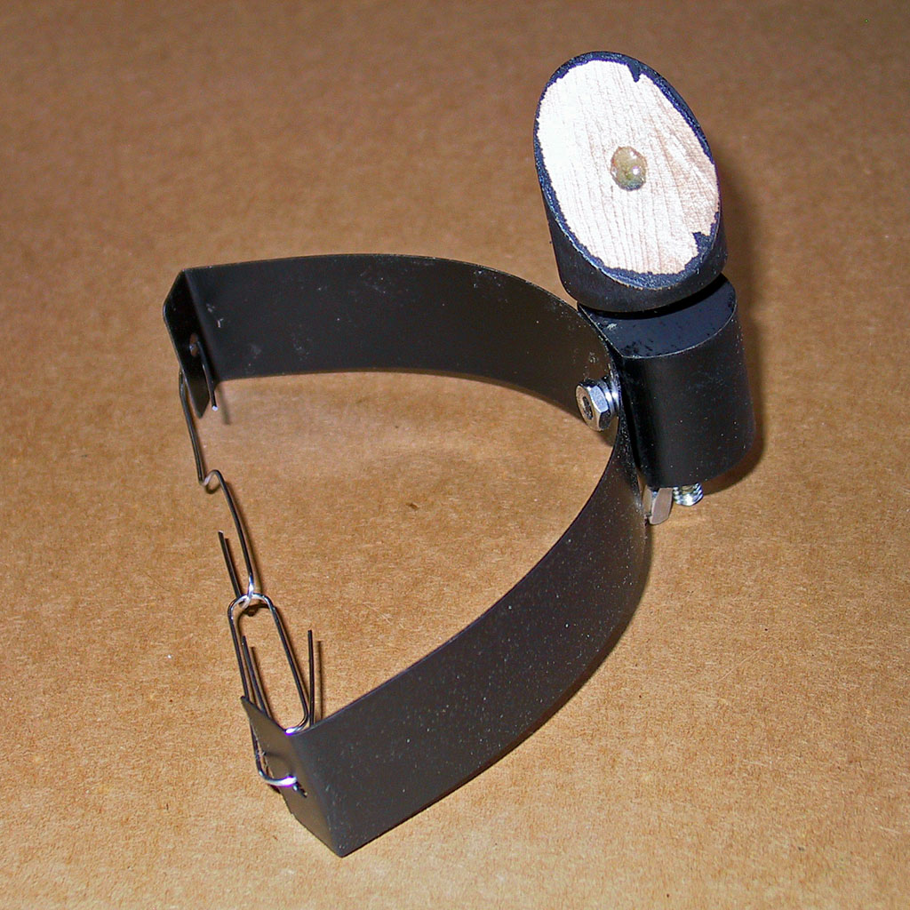{width=60%}

### Приклейка вторички

1. Тыльную (плоскую) сторону зеркала **обезжирить** изопропилом
2. Каплю **нейтрального силикона** размером с горошину — в центр тыльной стороны
3. Прижать к посадочной площадке держателя. Зеркало должно быть повёрнуто отражающей стороной вниз, **под 45° к оси трубы**
4. Высохнуть 24 часа. Не трогать!

### Установка паука в трубу

1. Покрасить лапки паука и пятаки **внутри** трубы матовой чёрной (свет идёт мимо них — каждая блестящая поверхность гадит контраст)
2. Вставить паук в трубу с верхнего края, ориентировать так, чтобы держатель смотрел в сторону отверстия фокусёра
3. Закрепить **M5×12 болтами** через стенку трубы и пятаки паука. Болт снаружи → картон → пятак → гайка M5
4. **Подтягивать болты равномерно крест-накрест** — паук должен быть натянут, но не деформирован

### Позиционирование вторички

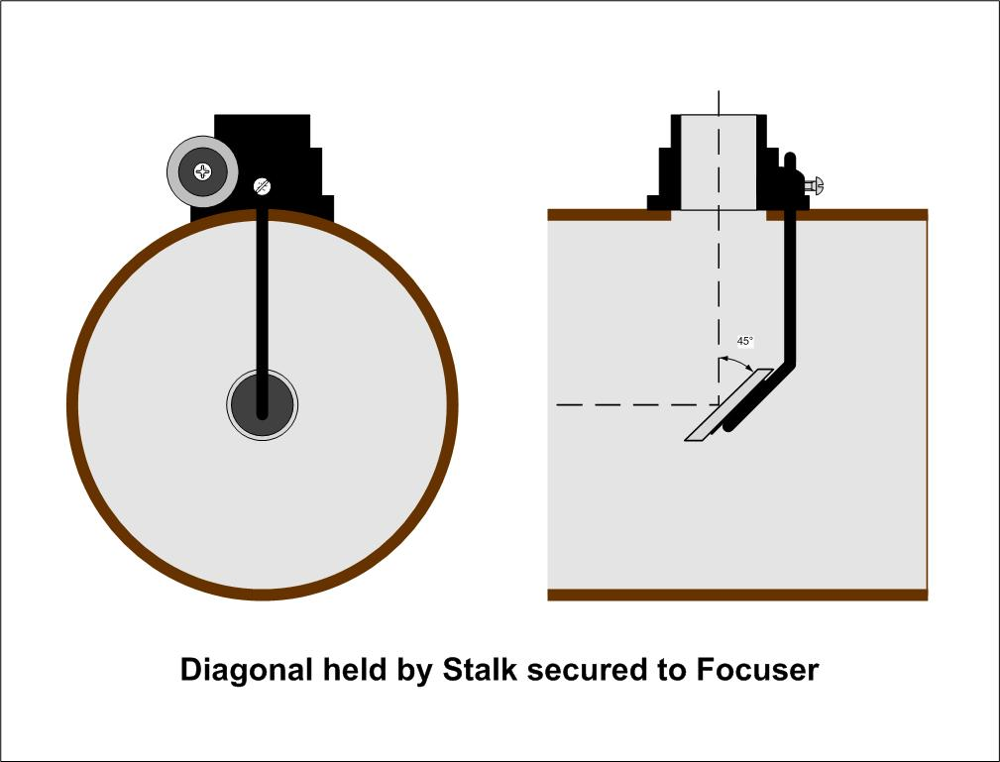{width=65%}

- Центр вторички — точно на оси трубы
- Отражающая поверхность смотрит в отверстие фокусёра
- Расстояние от главного: ~1050мм (это и есть позиция отверстия паука)

---

## Фаза 5 — Сборка фокусёра Leavitt

Полностью пластиковая конструкция с цанговым зажимом. Окуляр вкручивается/выкручивается вращением.

### Детали (все в `stl/`)

| Деталь | Файл |
|---|---|
| Внешний корпус (верх) | `Focuser outer top.stl` |
| Внешний корпус (низ) | `Focuser outer bottom.stl` |
| Внутренняя труба | `Focuser inner.stl` |
| Кольцо | `Focuser ring.stl` |
| Панель grub-винтов | `Focuser grub screw panel.stl` |
| Grub-винт | `Focuser grub.stl` |
| Цанга | `Collet.stl` |
| Гайка цанги | `Collet nut.stl` |
| Адаптер 1.25" | `1.25 eyepiece adapter.stl` |

### Принцип

Внутренняя труба ввинчивается во внешний корпус по резьбе — это и есть фокусировка (вращением). Окуляр зажимается цангой (collet), которая сжимается гайкой. Адаптер 1.25" — переходник под стандартный окуляр.

### Сборка

1. Покрасить внутренние поверхности матовой чёрной аэрозолью (внутри `Focuser inner`, `Collet`, `1.25 adapter`)
2. Собрать `Focuser outer bottom` + `Focuser outer top` через 4 болта M5×12 — это внешний корпус
3. Ввинтить `Focuser inner` в корпус через `Focuser ring` — лёгкое вращение, но без люфта
4. Установить `Collet` внутри `Focuser inner`, навинтить `Collet nut`
5. Установить `Focuser grub` через `Focuser grub screw panel` — фиксатор окуляра
6. Адаптер 1.25" вкручивается в `Collet`

{width=60%}

### Установка фокусёра в трубу

Через отверстие 45-50мм, которое сверлили в Фазе 2. Болтами M5×12 через 4 крепёжных уха на `Focuser outer bottom`.

{width=70%}

---

## Фаза 6 — Финальный монтаж в трубу (без зеркал!)

К этому моменту в трубе должны быть:

- Покрашенный изнутри сонотуб с готовыми отверстиями
- Установленный паук (без вторички пока — она клеится отдельно)
- Установленный фокусёр

Оправа главного **ещё не установлена** — собирается отдельно, ставится в самом конце.

**Проверка:**

- Посмотри в фокусёр без окуляра. Через него должен быть виден держатель вторички
- Покрути фокусёр — внутренняя труба ходит плавно
- Всё пластиковое и картонное должно быть жёстким, без люфтов

---

## Фаза 7 — Рокер-бокс и люлька

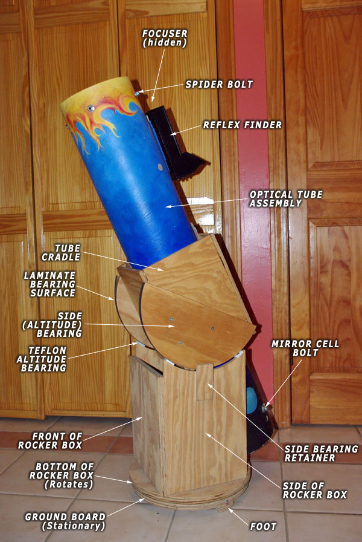{width=80%}

### Компоненты Stellafane-добсона

1. **Тубус-люлька (cradle)** — деревянный обхват сонотуба, к нему крепятся высотные подшипники
2. **Высотные подшипники (side bearings)** — два деревянных круга, по бокам люльки. Лежат в полукруглых вырезах рокер-бокса
3. **Рокер-бокс (rocker)** — П-образный ящик из фанеры, в стенках вырезы под высотные подшипники
4. **Ground board** — нижняя пластина, на которой стоит рокер
5. **Азимутальная ось** — M10×60 болт по центру + PTFE-пятаки (3 шт через 120°) обеспечивают вращение

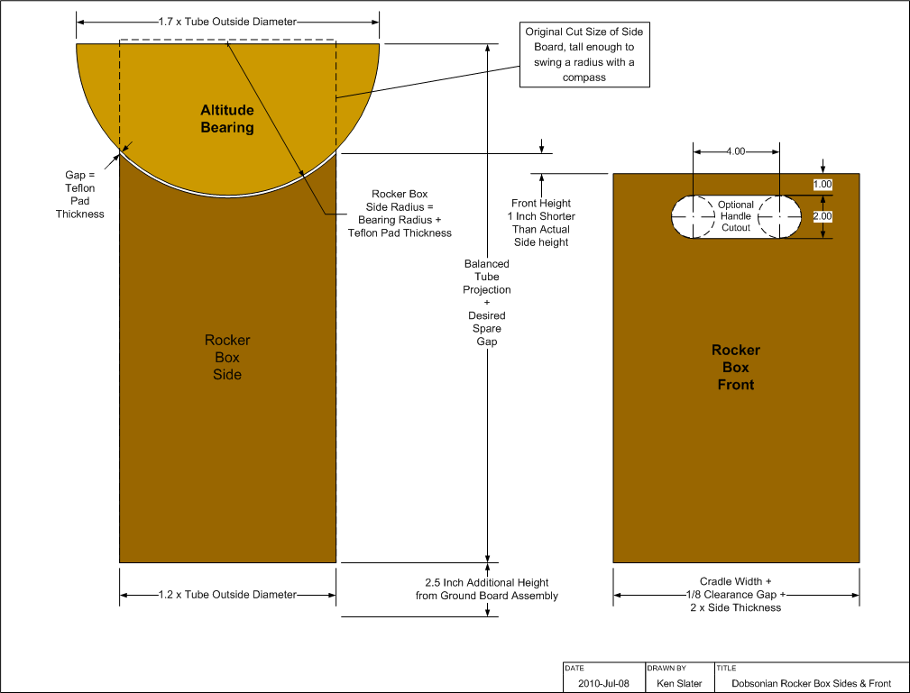{width=80%}

### Размеры

**Люлька:**

- Два кольца из фанеры 18мм, внутренний диаметр 258мм (OD сонотуба), внешний 320мм
- Расстояние между кольцами 200мм
- Соединяются 4 продольными планками 30×30мм по углам

**Высотные подшипники:**

- Два круга фанеры 18мм, диаметр 200мм
- Крепятся к боковым планкам люльки шурупами
- На рабочую поверхность (контакт с рокером) — наклеить PTFE полосу

**Рокер-бокс:**

- Две боковые стенки фанеры 18мм, высота 350мм, длина 350мм
- В верхней части — полукруглый вырез радиусом 100мм (под подшипник)
- В вырезе — 2 PTFE-пятака на расстоянии 90° друг от друга
- Передняя стенка 350×200мм
- Дно — фанера 350×350мм

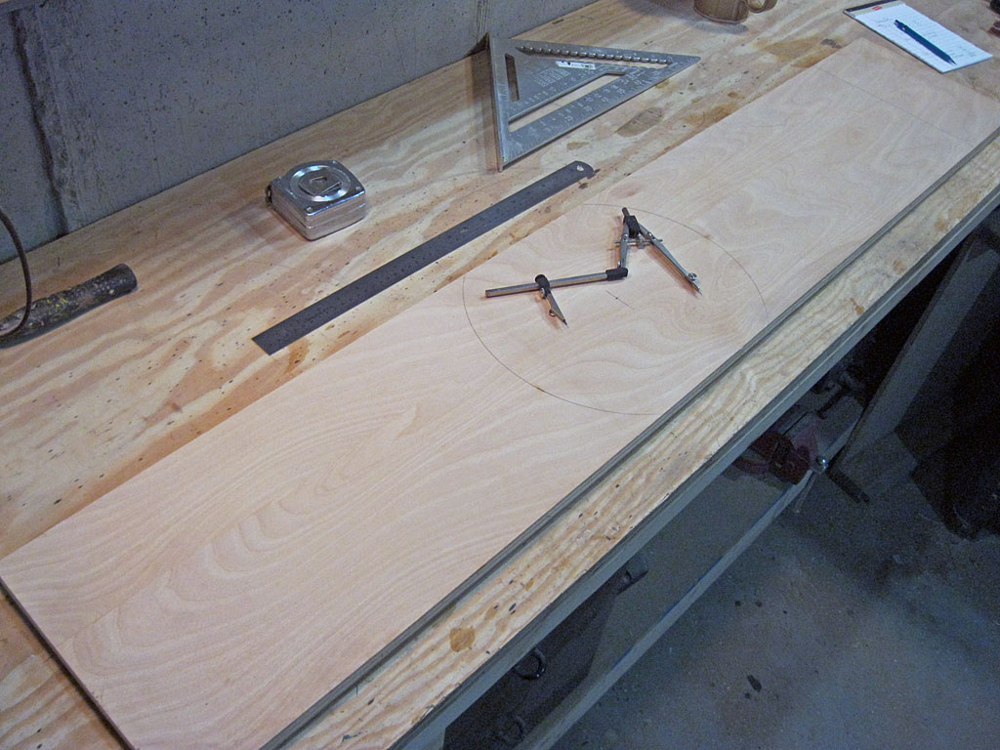{width=70%}

**Ground board:**

- Квадрат фанеры 18мм, 400×400мм
- По центру отверстие Ø10мм под M10 ось
- 3 PTFE-пятака на радиусе 150мм через 120° (азимутальный подшипник)
- 3 ножки (резиновые мебельные)

### Балансировка

Положение люльки на трубе подбирается так, чтобы при горизонтальном положении трубы она была сбалансирована относительно высотных подшипников. **Точку баланса найти эмпирически** до окончательной фиксации:

- Собрать трубу со всеми узлами (оправа без зеркала, паук, фокусёр, искатель)
- Подложить под трубу временный валик, найти центр тяжести
- На этой точке должна быть середина люльки

Обычно центр тяжести для 8" Ньютона с сонотубом — примерно в 600-650мм от нижнего края трубы.

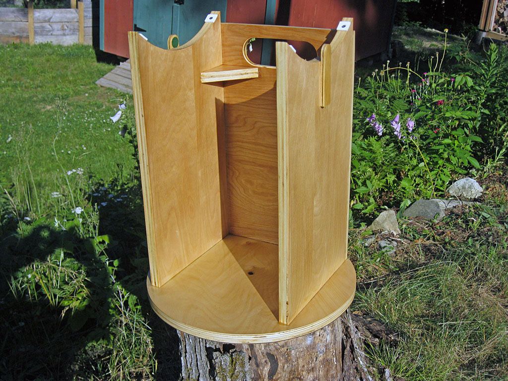{width=70%}

---

## Фаза 8 — Установка зеркал (САМОЕ ПОСЛЕДНЕЕ)

⚠️ **Зеркала ставим только когда вся трубовая часть собрана и проверена.** Хрупкость + чувствительность к пыли = не место для них во время монтажа.

### Главное зеркало

1. На передней пластине оправы — 3 войлочные прокладки (если ещё не наклеены)
2. Зеркало уложить вогнутой стороной вверх на прокладки
3. **3 капли нейтрального силикона** на края зеркала между прокладками. Размер — с горошину. ⚠️ ТОЛЬКО нейтральный (Super 7 или аналог) — кислотный разъедает алюминиевое покрытие!
4. 24 часа сушки
5. Установить оправу в нижний конец трубы — уголками к стенке. Болты M5×12 через картон, гайки изнутри (или шурупы по дереву наружу)
6. Барашки коллимации (M5) должны быть **снаружи трубы снизу** — туда ты будешь тянуться при юстировке

### Вторичное зеркало

Уже должно быть приклеено к держателю (см. Фазу 4). Если ещё нет — клеить сейчас, ждать 24 часа.

---

## Фаза 9 — Коллимация

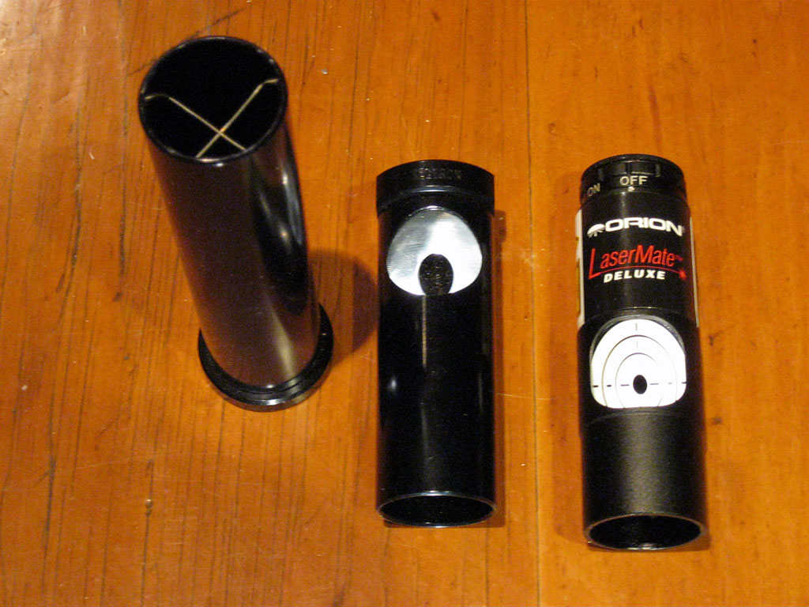{width=70%}

### Инструменты

- Лазерный коллиматор (под 1.25")
- Cheshire / калибровочный окуляр

### Этапы

1. **Центральная метка на главном зеркале.** Если зеркало пришло без метки — наклей на центр маленький бумажный кружок Ø6-8мм. Это эталон для коллимации.

2. **Юстировка вторички** (винтами держателя):
   - Лазер в фокусёр
   - Луч должен попадать строго в центральную метку главного
   - Если нет — крути 3 винта держателя вторички (это наклоняет и вращает вторичку)

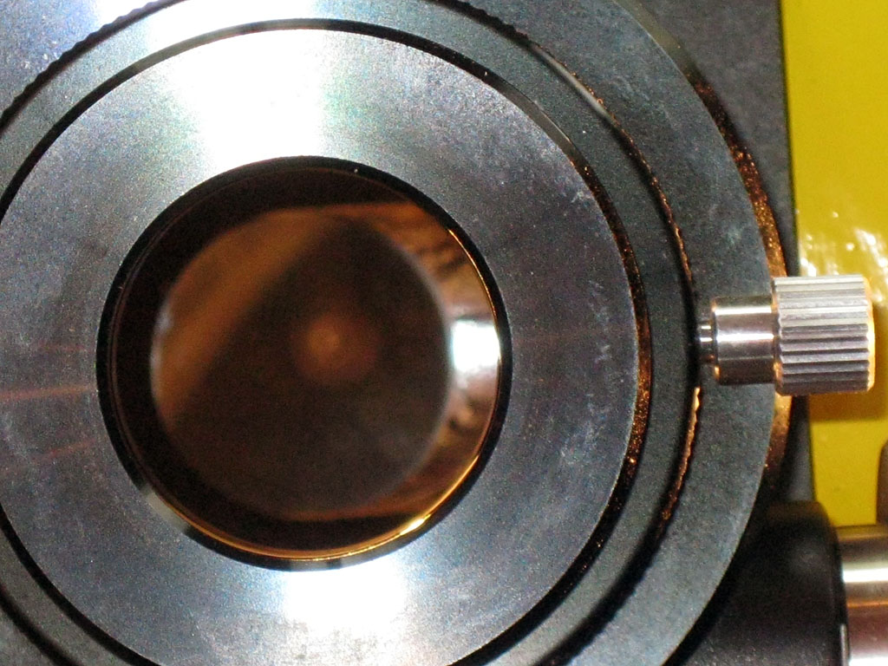{width=70%}

3. **Юстировка главного** (барашками внизу оправы):
   - Лазер всё ещё в фокусёре
   - Отражённый от главного луч должен вернуться обратно в окошко лазера
   - Если нет — крути 3 барашка внизу оправы (push-pull)

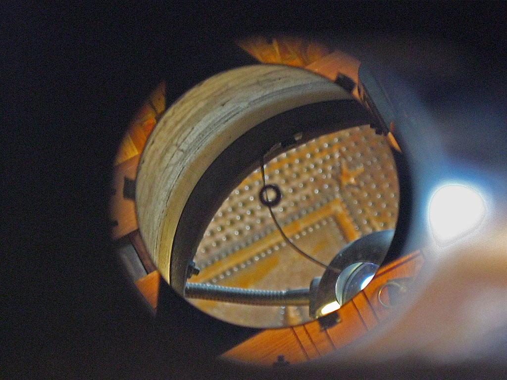{width=70%}

4. **Финальная проверка через Cheshire** — концентрические окружности должны совпадать.

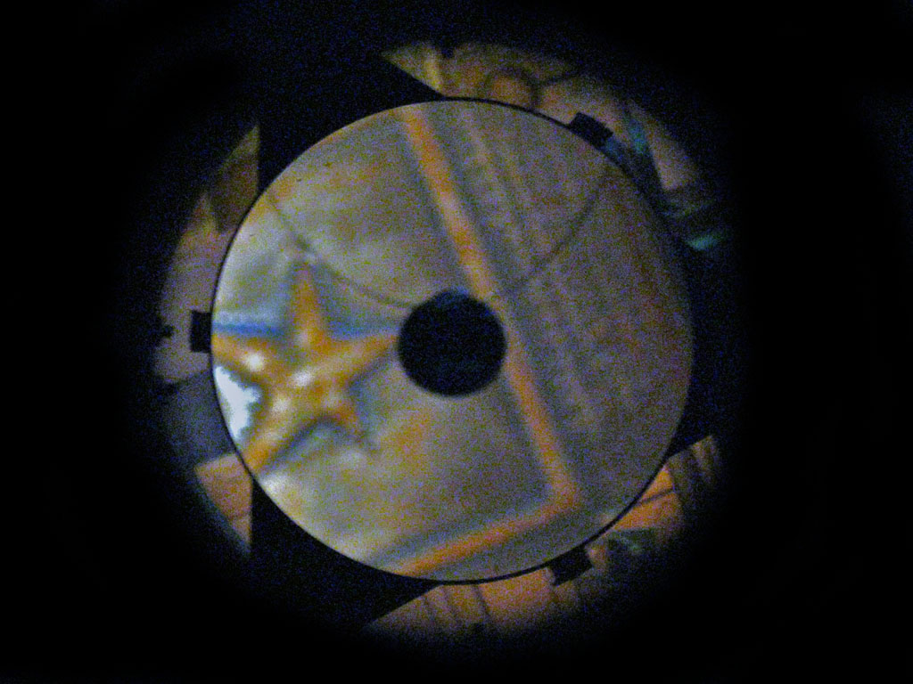{width=70%}

---

## Первый свет — чеклист

| □ Все винты подтянуты
| □ Коллимация выполнена
| □ Окуляр 25мм в фокусёре
| □ Искатель SVBONY юстирован днём по дальнему объекту (антенна, мачта)
| □ Телескоп вынесен на улицу за 30 мин до наблюдения (термостабилизация)
| □ Наводимся на Луну или яркую планету
| □ Крутим фокусёр до резкости

Поздравляю — у тебя работающий 8" Ньютон.

---

## Ссылки

- Оригинал Leavitt: <https://sites.google.com/view/203-leavitt-telescope>
- Stellafane Dobsonian: <https://stellafane.org/tm/dob-atm/>
- Stellafane Mirror Cell: <https://stellafane.org/tm/newt-tel/mirror-cell.html>
