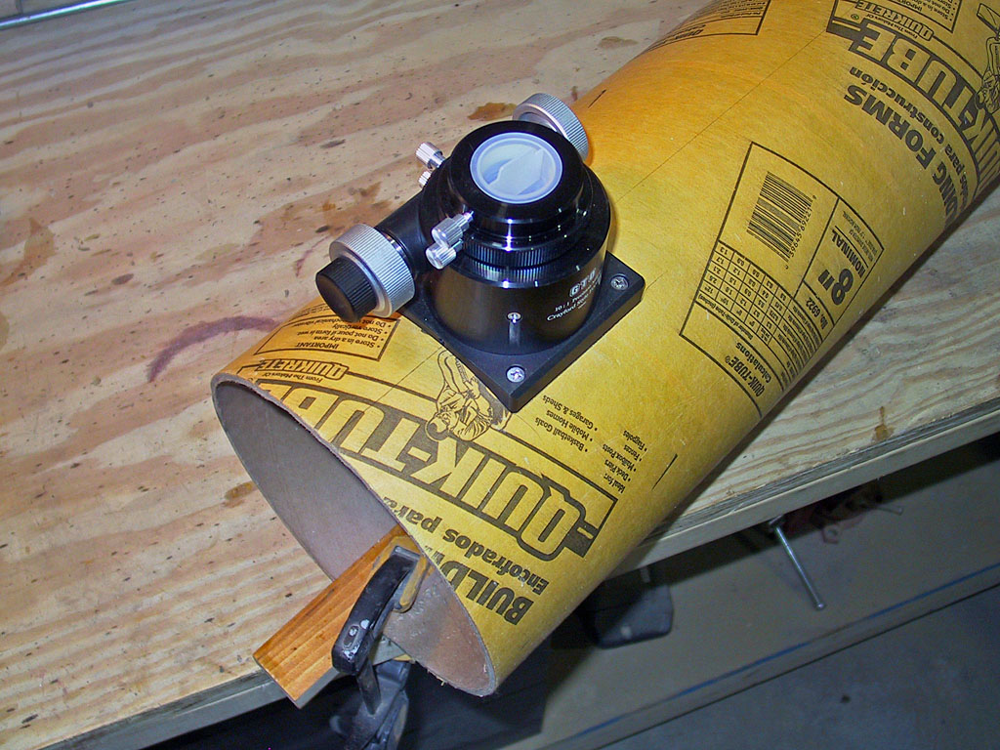
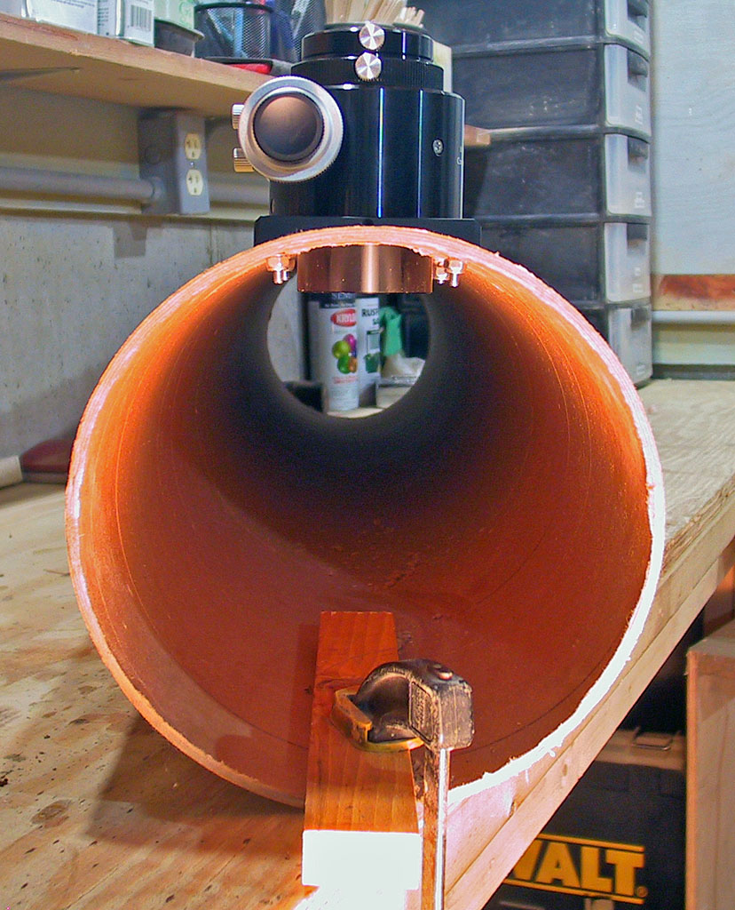

# Что это

**Фокусёр** — узел, в который вставляется окуляр. Вращением `Focuser inner` относительно корпуса окуляр смещается ближе/дальше — это и есть фокусировка. Конструкция Leavitt: полностью пластик, без подшипников, цанговый зажим окуляра.

В готовом телескопе он сидит сбоку трубы:

{width=55%}

10 печатных деталей + горсть M5. Время на сборку — час.

---

# Детали

| № | Деталь | Что делает |
|---|---|---|
| 1 | `Focuser outer bottom` | Нижняя половина корпуса. 4 крепёжных уха по углам — потом через них фокусёр сядет на трубу |
| 2 | `Focuser outer top` | Верхняя половина корпуса. Соединяется с bottom через 4× M5×12 |
| 3 | `Focuser inner` | Подвижная труба с **внешней резьбой**. «Бегунок», который двигает окуляр |
| 4 | `Focuser ring` | Резьбовое кольцо, фиксирующее inner в корпусе |
| 5 | `Collet` | Цанга, 4 лепестка |
| 6 | `Collet nut` | Гайка цанги. Конус внутри сжимает лепестки → зажим окуляра |
| 7 | `Focuser grub` | Доп. фиксирующий винт |
| 8 | `Focuser grub screw panel` | Панелька-гнездо под grub |
| 9 | `1.25 eyepiece adapter` | Скользящая посадка в цангу, под стандарт 1.25" |
| 10 | `Focuser saddle` | Седло между плоским дном фокусёра и круглой трубой (компенсирует кривизну OD 258мм). **Не нужно для сборки фокусёра** — пригодится при монтаже на трубу |

## Крепёж

- **8× M5×12** болтов hex — на корпус (4) и grub-панель (≤2). Остальные пойдут позже на крепление к трубе
- **8× M5** гаек — соответственно

## Инструменты

- Шестигранник под головку M5 (обычно 4мм) или плоская/крестовая отвёртка (зависит от партии Galboreg)
- Ключ на 8мм для M5 гаек — или пальцы, M5 затягивается руками
- Нож/надфиль на случай зачистки заусенцев печати

---

# Сборка

## 1. Раскладка

Достань все 9 деталей фокусёра (10-я — седло — пока в сторону). Опознай их по таблице. Резьбы и цангу спутать невозможно, корпусные половины различай по наличию ушей.

Покраска не нужна — пластик уже чёрный матовый.

## 2. Корпус: bottom + top

Уложи `Focuser outer bottom` на стол ушами вниз. Сверху положи `Focuser outer top` так, чтобы 4 угловых отверстия совпали.

4× M5×12 насквозь сверху вниз → M5 гайка снизу. Затяжка — **только до прекращения люфта**. Слишком сильно — пластик трескается у ушей.

## 3. Резьбовая пара inner + ring + корпус

Накрути `Focuser ring` на резьбу `Focuser inner` примерно на середину. Эту пару вставь сверху в центральное отверстие корпуса. Ring ложится на верхнюю плоскость корпуса и работает упором.

Проверь: вращение inner относительно корпуса должно идти **плавно, без закусываний и без люфта в радиальном направлении**.

> **Если резьба закусывает** — стандартная проблема FDM-печати: микрозаусенцы на витках. Сними фаску ножом, или прогони канцелярским ножом по виткам наискось — 1-2 оборота. Смазку накладывать только ПОСЛЕ прочистки, иначе она забьёт мусор внутрь.

## 4. Цанга

Вставь `Collet` в верх `Focuser inner` лепестками **вверх**, широким основанием вниз. Сверху накрути `Collet nut` на оставшуюся резьбу inner — её внутренний конус будет обжимать лепестки при затяжке.

Проверь работу зажима: затягивая nut вручную, лепестки должны заметно сходиться. Палец, просунутый в цангу, ощутит сжатие.

## 5. Grub-фиксатор

`Focuser grub screw panel` ставится сбоку на `Focuser outer top` — там есть посадочное место с двумя отверстиями. Фиксируется 2× M5×12 + гайки. В резьбовое отверстие панели вкручивается `Focuser grub` — страховочный зажим, на случай если цанга со временем ослабнет.

## 6. Адаптер 1.25"

`1.25 eyepiece adapter` вкручивается сверху в цангу через collet nut. Затяжкой nut он фиксируется внутри. В сам адаптер потом будет вставляться окуляр.

---

# Проверка

1. Вращение inner — плавное, без люфта вбок
2. Окуляр 25мм (Plossl, в коробке оптики) вставляется в адаптер 1.25" свободно
3. Затяжка collet nut от руки — окуляр сидит жёстко, при тряске не выпадает
4. Ослабление — окуляр вынимается без усилия

---

# Если не работает

| Симптом | Причина / решение |
|---|---|
| Резьба inner закусывает | Заусенцы печати. Прогнать ножом по виткам, потом графит (карандаш) на резьбу как сухая смазка |
| Inner болтается радиально | Ring недотянут — подкрути его на корпусе |
| Цанга не зажимает | Лепестки склеились при печати (мостами). Раздвинь их ножом, проверь геометрию |
| Не вкручивается M5 болт | Криво заходит → сорвёт резьбу в пластике. Выкрути, выровняй, иди по оси |
| Резьба inner↔ring сидит идеально, а inner↔corpus играет | Разная усадка партий филамента. Если печаталось разными катушками — типовой косяк, фиксится прокладкой PTFE-лентой или микрослоем эпоксидки на резьбу |

---

# Дальше — крепление на трубу (с седлом)

Сам по себе фокусёр — плоское дно. Сонотуб — круглая труба OD 258мм. Между ними нужно **седло** (`Focuser saddle.stl`), компенсирующее кривизну. Без него фокусёр болтается на 8мм зазоре по углам.

```
   [Focuser outer bottom] ──────  плоское дно
                              ──────────────
   [Focuser saddle]           сверху плоско, снизу дуга R=129мм
                                 ╲                          ╱
                                  ╲________________________╱
                              ▓▓▓▓▓▓▓▓▓▓▓▓▓▓▓▓▓▓▓▓▓▓▓▓▓▓▓▓▓▓     ← сонотуб OD 258
```

Сборка идёт сэндвичем: **ухо фокусёра → стенка трубы → седло → гайка снаружи**. Болты — **M5×25** (нынешних M5×12 не хватит, надо докупить). После затяжки всё сидит без люфта.

## Печать седла

Файл: `stl/Focuser saddle.stl` (101×90×11мм, ~50г PLA).

| Параметр | Значение | Почему |
|---|---|---|
| Сопло | 0.4мм | Стандарт |
| Слой | 0.2мм | 0.25 тоже ок |
| Стенки | 4 периметра | Конструктивная деталь — болты затягиваются через неё |
| Заполнение | 25%, gyroid | Грузится на сжатие — gyroid оптимален |
| Ориентация | **Плоской стороной вверх, вогнутой дугой к столу** | Плоская поверхность под фокусёр должна быть чистой → она идёт верхом печати |
| Поддержки | Да, от стола | Вогнутое дно нависает над столом — без supports не напечатается |
| Brim | Не нужен | Площадь контакта с supports достаточная |

> Болт-отверстия и центральная Ø50 дыра прорезаны цилиндрами по 128 сегментов; нижняя дуга — 1024 сегмента на цилиндре R=129мм. Если в Apple Preview видны лесенки на круглых краях — это артефакт его рендера, не геометрии. Открой в OrcaSlicer/Cura — там будет видно как есть на самом деле.

---

{width=60%}

Сборка фокусёра отдельная от установки. Сначала собираем на столе → проверяем → потом ставим на трубу через седло (после сверловки отверстий в сонотубе).
