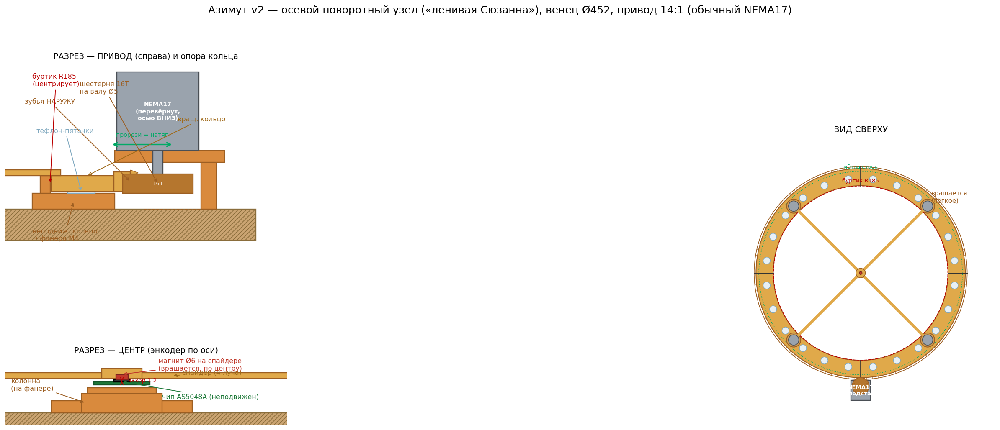
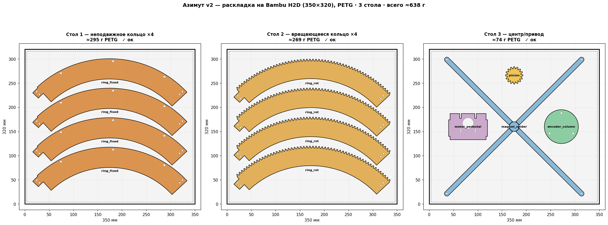

# Азимут v2 — осевой поворотный узел («ленивая Сюзанна»)

Альтернатива боковому венцу (`../generate_rocker_azdrive.py`). Два плоских кольца
лежат **торцами друг на друге** (упорный подшипник скольжения по тефлону), НЕ
вложены сбоку. Зацепление, шестерня и энкодер — 1:1 из существующего азимута.

Генератор: `generate_az2.py` (движок как у проекта — `trimesh`+`manifold3d`+`shapely`,
запуск `/opt/homebrew/bin/python3`). Схема: `_az2_preview.py` → `az2_scheme.png`.



## Принцип

- **Неподвижное кольцо** прикручено к фанере (M4). Верхняя грань — гладкая
  **дорожка** (обклеить ламинатом/PET-скотчем). По **внутренней** окружности —
  **буртик R185**, центрирует вращающееся кольцо (по наружной окружности
  ограничителя НЕТ — зубьям ничто не мешает).
- **Вращающееся кольцо** лежит сверху на **тефлоновых пятачках** (24 шт по кругу,
  в карманах дна). Зубья (224T, наружу) торчат за край — их крутит шестерня.
  Несёт только магнит (по центру) + стойки — **лёгкое**.
- **Мотор — на фанере**, но на **печатной подставке** и **перевёрнут осью ВНИЗ**:
  так шестерня 16T встаёт на уровень зубьев (z9..19), а не висит высоко. 4×M3
  крепления мотора — **прорези по радиусу** → сдвигаешь мотор, ставишь натяг
  зацепления, затягиваешь.
- **Энкодер:** магнит Ø6×2.5 по центру на **спайдере** (крестовина, вращается);
  чип AS5048A на **неподвижной колонне** по центру смотрит вверх, зазор ~1.2 мм.
  Через вращающийся стык не идёт ни один провод.
- Сверху на 4 стойках Ø22 — **седло** (интерфейс существующих `Rocker_ring_saddle`
  / `Rocker_cradle` / `Rocker_alt_roller`, «верх» не менялся).

## Детали (всё PETG, кроме крепежа/тефлона)

| STL | Кол-во | Габарит | Объём | Назначение |
|---|---|---|---|---|
| `az2_ring_fixed_seg` | ×4 (90°) | 98×317×17 | 116 см³ | неподвижное кольцо + буртик |
| `az2_ring_rot_seg`   | ×4 (90°) | 99×322×30 | 106 см³ | вращающееся кольцо + зубья + гнёзда стоек |
| `az2_magnet_spider`  | ×1 | 279×279×5 | 24 см³ | крестовина магнита (вращается) |
| `az2_encoder_column` | ×1 | 70×70×16 | 29 см³ | колонна чипа AS5048A (неподвижна) |
| `az2_motor_pedestal` | ×1 | 80×56×30 | 56 см³ | подставка мотора, прорези-натяг |
| `az2_pinion_16T_bore5`| ×1 | 36×36×10 | 8 см³ | шестерня 16T, бор Ø5.25 (вал обычного NEMA17) |

Все сегменты влезают на стол H2D (350×320). Стыки сегментов — half-lap + 2×M3
(как в существующем венце), попадают во впадины зубьев.

## Стек по Z (z=0 — верх фанеры)

```
 0..8   неподвижное кольцо (тело) → фанера
 8..17  буртик R185 (центрирует)
 9      тефлон-пятачки (зазор 1 мм; тефлон 1.5 → 0.5 проступ)
 9..17  вращающееся кольцо (тело)
 9..19  зубья вращающегося кольца (наружу)
 8..18  шестерня 16T на валу Ø5 обычного NEMA17 (мотор перевёрнут)
 30     фланец мотора = верх подставки (PED_TOP_Z — подогнать под длину вала!)
 15.5   чип AS5048A ↑     16.7  магнит ↓     (зазор 1.2)
 17..22 спайдер + ступица магнита
```

## Проверенные зазоры (по превью)

- Стойка (гнездо Ø30, PCD 197 → мётла до R212), проходя под мотором, **не бьётся**
  о плиту подставки (внутр. край R218): зазор ~6 мм.
- Пинион (R222..258) спускается к зубьям мимо ног подставки (внутр. угол R234).
- Плита подставки (z24..30) над зубьями кольца (z≤19) — зазор 5 мм.

## Передача — БЕЗ ПОКУПОК (2026-07-11)

Мотор — **обычный NEMA17, который уже куплен**. Ничего докупать не нужно.

- **Сейчас: прямой привод 14:1** — шестерня Ø5.25 прямо на валу NEMA17.
  Простейшее, ровно перевёрнутая схема. Стоек — **4**.
- **Если 14:1 слабовато по моменту** (страгивание PTFE на холоде/росе) — добавить
  **ПЕЧАТНУЮ ступень редукции 3:1 → 42:1** (тоже без покупок):
  - печатные шестерни spur (напр. 15T→45T, модуль 2) на промежуточном валу **Ø8**
    (пруток уже куплен) на **2×608ZZ** (в наличии);
  - тогда 16T-шестерню (бор Ø8) несёт промвал, он и спускается к зубьям; мотор
    крутит большую шестерню сверху (переворот уже не обязателен);
  - это печатный аналог ремённой ступени v1 (42:1), только вместо GT2 — печатные
    зубья. Отдельный узел, сгенерю по запросу.
  - Альтернатива без печати: та же ступень **ремнём GT2 20:60** (шкивы/ремень тоже
    уже куплены под v1).

## Открытые пункты (проверить на первой печати)

1. **`PED_TOP_Z`=30** (высота подставки) подогнать под реальную длину вала NEMA17
   (шестерня должна встать на z9..19). Проверить на первой печати.
2. **Зазор спайдер↔плата энкодера** (~1.5 мм) — проверить с реальной платой
   (у клона AS5048-AB сверху гребень 2.54 мм); при нужде приподнять ступицу.

## Раскладка на столе (H2D 350×320, PETG) — `az2_bed_layout.py` → `az2_bed_layout.png`

**3 стола, ≈640 г PETG** (проверено: пересечений нет, всё в печатной зоне):

| Стол | Детали | ≈г |
|---|---|---|
| 1 | `ring_fixed_seg` ×4 (дуги вложены, шаг ~61 мм) | 295 |
| 2 | `ring_rot_seg` ×4 (дуги вложены) | 269 |
| 3 | `magnet_spider` + `encoder_column` + `motor_pedestal` + `pinion` (в промежутках между лучами креста) | 74 |

Дуги 90° кладутся хордой (317) вдоль оси 350 и нестятся стопкой (концав верхней
на конвексе нижней) → 4 на стол вместо 3 встык.



## Порядок печати/сборки

1. **Калибровка (первый, неполный стол):** 1×fixed + 1×rot сегмент + pinion +
   pedestal → надеть свой NEMA17, проверить высоту вала (PED_TOP_Z), зацепление,
   натяг прорезями. Печатать усадку/зазоры ДО полных столов.
2. Остальные сегменты (Стол 1 без одного + Стол 2 без одного), собрать оба кольца
   (half-lap+M3), обклеить дорожку ламинатом, вклеить тефлон-пятачки.
3. Стол 3: колонна + спайдер + плата AS5048A → выставить зазор магнита, откалибровать.
4. Стойки Ø22 + седло (существующий «верх»).
